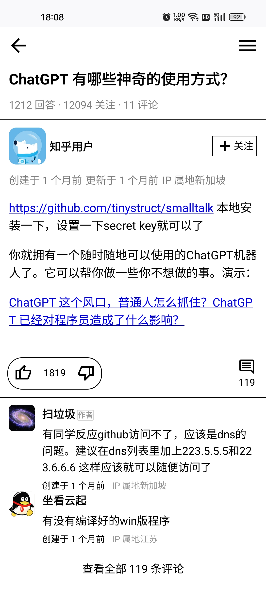
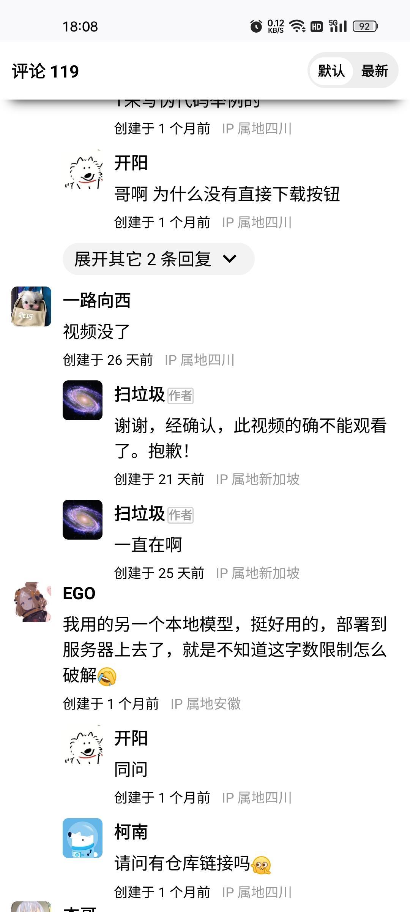
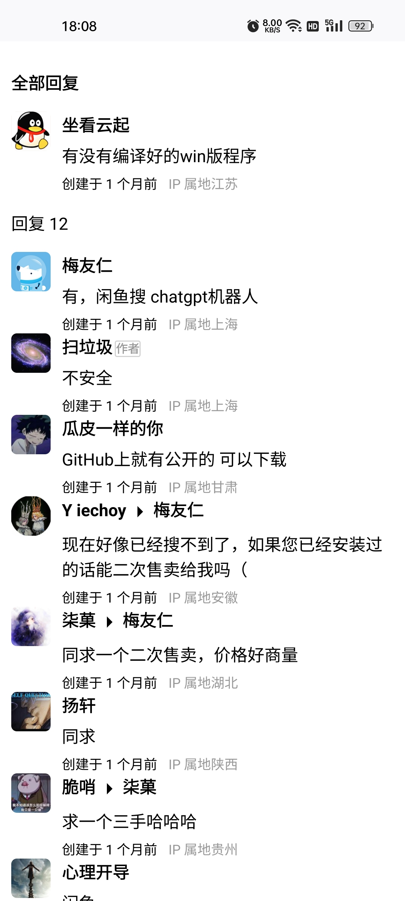

# Bismuth

第三方移动端网页知乎。

前端使用 Vue3，koa 实现的简单后端以绕过同源策略。可以通过 PWA 安装。

使用知乎 PC 端网页 API。

## 页面

- 首页
  

- 回答
  

- 评论
  

- 回复
  

- 以及更多……

## 部署

后端代码位于 `server` 目录下，你可能需要稍作修改。

> 注意：后端代码的依赖项不在本项目的 `package.json` 中。

`https` 证书请放在 `cert` 目录内。

如果你没有 `https` 证书，你可以将项目部署在 `http` 上。

> 注意：一个可安装的 PWA 应用要求使用 `https` 传输。
